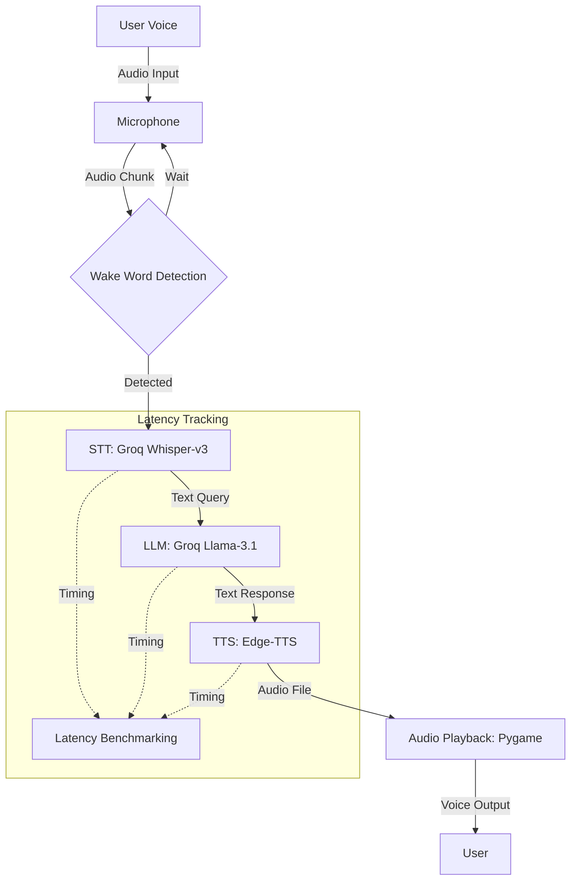

# Architecture Diagram: Voice Assistant

## System Flow
1. **Wake Word Detection**: The system continuously listens for the word "assistant". Audio is transcribed via Groq's Whisper-v3 model.
2. **STT (Speech to Text)**: Once the wake word is detected, the query is captured and transcribed using the same ultra-fast Groq Whisper API.
3. **LLM Interaction**: The transcribed text is sent to the Groq API (Llama-3.1-8b model) for a concise response.
4. **TTS (Text to Speech)**: The LLM's response is converted to audio using Microsoft Edge's Neural TTS.
5. **Playback**: The audio is played back to the user via Pygame.
6. **Latency Measurement**: Each stage (STT, LLM, TTS) is timed to provide a detailed performance report.
